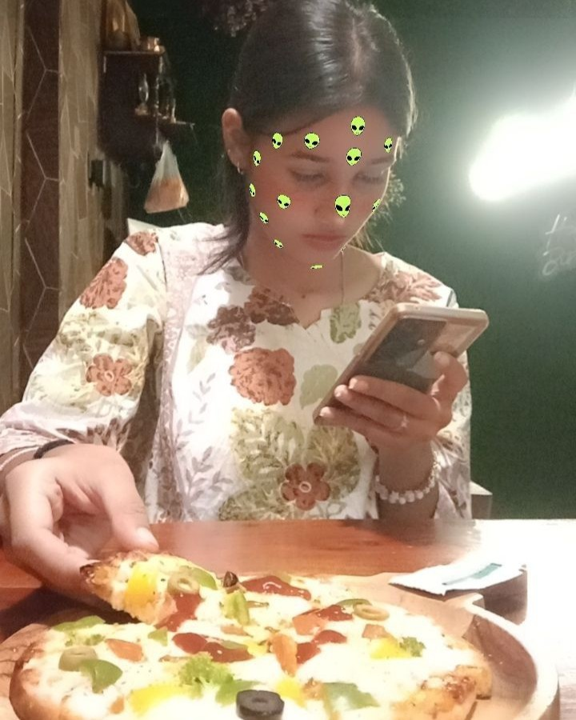

# 🎂 Special Birthday Website 💖

### Make someone's birthday a little more special. ✨

A beautiful, interactive and customizable birthday website made for creating a **personal digital birthday surprise** for someone special.

It includes animated birthday content, background music, interactive flower/emoji effects, a photo scrapbook, sticky notes, and a hidden birthday letter — all in one little website. 🌸🎁

> 💡 **The idea is simple:**
> Change the name, replace the photos, choose your own birthday song, customize the messages — and you're ready to surprise someone.

---

## ✨ What's Inside?

🎁 **Welcome Surprise**
A welcome popup asks the birthday person to turn up the volume before opening the surprise.

🎵 **Birthday Music**
Background music starts with the surprise and comes with simple play, pause, mute and volume controls.

🎂 **Animated Birthday Section**
A colorful animated birthday introduction with the person's name, photo, balloons and decorations.

🌸 **Click Animations**
Click anywhere on the page and flowers, hearts, stars, gifts and other emojis appear around your click.

📸 **Memory Scrapbook**
A scrapbook-style section with photos, Polaroid cards and cute sticky notes.

📝 **Personal Notes**
Add your own messages, birthday checklist, memories, wishes or anything you want to say.

💌 **Secret Birthday Letter**
Click the envelope to open a personalized letter with another interactive animation.

📱 **Mobile Friendly**
Designed to work on both phones and desktops.

---

# 💝 Make It Yours

You don't need to understand the entire code.

The website is already built.

**Just personalize a few things.**

---

## 1. 👤 Change the Name

The current version uses **Maria** as the example name.

You can find the name in several places in the HTML.

For example:

```html
<title>Happy Birthday Maria</title>
```

Change it to:

```html
<title>Happy Birthday HER NAME</title>
```

You'll also find it in the birthday section:

```html
<span>Dear Maria</span>
```

Change it to:

```html
<span>Dear HER NAME</span>
```

And don't forget the birthday letter and other messages.

### 🔎 Tip

Search the HTML file for:

```text
Maria
```

Then replace the relevant occurrences with your person's name.

---

# 2. 📸 Replace the Photos

The website uses multiple images for the main profile photo and scrapbook memories.

For example:

```html

```

and:

```html



```

Replace these images with your own photos.

### Example

If your new photo is:

```text
images/her-photo.jpg
```

you can change:

```html

```

to:

```html

```

You can also replace the scrapbook photos with your favorite memories together. ❤️

> 📌 **Important:** Keep your image paths correct. If you move an image to another folder, update the `src` path in the HTML.

---

# 3. 🎵 Change the Birthday Song

The website currently loads the music from:

```text
audio/Maria.mp3
```

The audio is connected through:

```html
<audio id="bgMusic" src="audio/Maria.mp3" preload="auto" loop></audio>
```

Simply put your preferred song inside the `audio` folder and change the filename.

For example:

```html
<audio id="bgMusic" src="audio/birthday-song.mp3" preload="auto" loop></audio>
```

That's it. 🎶

> ⚠️ If you're publishing the website publicly, make sure you have permission to use the music you upload.

---

# 4. 📝 Customize the Messages

This is where you can make the website truly personal.

You can edit:

* 💌 Birthday wishes
* 📝 Sticky notes
* 📸 Photo captions
* 🎂 Birthday checklist
* 💖 The final letter
* ✨ Any other text on the page

For example, the scrapbook contains notes like:

```text
Some people make life a little brighter just by being themselves.
```

You can replace that with your own message.

You can also completely rewrite the letter inside the envelope.

**Make it funny. Make it emotional. Make it romantic. Make it personal.**

That's the whole point. ❤️

---

# 📅 Change the Birthday Date

The birthday date is also displayed through JavaScript.

Currently it contains:

```javascript
let datetxt = "04 Sept";
```

Change it to the birthday date you want.

For example:

```javascript
let datetxt = "18 Oct";
```

---

# 🚀 Deploy Your Website

Once you've finished customizing it, you can host it for free.

There are two easy options.

---

## ⭐ Option 1 — Vercel

**Recommended**

[Vercel](https://vercel.com/) makes deploying a static website extremely easy.

### Step 1 — Create an account

Go to Vercel and sign up using your GitHub account.

### Step 2 — Upload the project to GitHub

Create a GitHub repository and upload your website files.

Your project should look something like:

```text
special-birthday-website/
│
├── index.html
├── style.css
│
├── images/
│   ├── photo1.jpg
│   ├── photo2.jpg
│   └── ...
│
└── audio/
    └── birthday-song.mp3
```

### Step 3 — Import the repository into Vercel

In Vercel:

**Add New → Project**

Select your GitHub repository and click:

**Import**

For this type of HTML/CSS/JavaScript website, you normally don't need any complicated configuration.

Click:

**Deploy 🚀**

After deployment, Vercel will give you a public URL.

Example:

```text
https://special-birthday-website.vercel.app
```

Send the link to your special person.

🎁 **And the surprise is ready.**

---

# 🐙 Option 2 — GitHub Pages

You can also host the website completely free using GitHub Pages.

### Step 1

Push your completed project to GitHub.

### Step 2

Open your repository.

Go to:

**Settings → Pages**

### Step 3

Under **Build and deployment**, select:

```text
Deploy from a branch
```

Then select:

```text
Branch: main
Folder: / (root)
```

Click **Save**.

GitHub will deploy your website.

Your URL will look similar to:

```text
https://your-username.github.io/special-birthday-website/
```

---

# 🎀 Quick Personalization Checklist

Before sending the website, check these:

```text
☐ Change the person's name
☐ Replace the main photo
☐ Replace scrapbook photos
☐ Change photo captions
☐ Change sticky-note messages
☐ Change birthday letter
☐ Change birthday date
☐ Add your preferred birthday song
☐ Test the website on your phone
☐ Test the music
☐ Test all buttons and animations
☐ Deploy 🚀
☐ Send the link 🎁
```

---

# ❤️ The Idea Behind This Project

This isn't meant to be another complicated website project.

It's meant to be something you can make **for someone you care about**.

You don't need to buy a domain.

You don't need a paid hosting plan.

You don't need to know advanced web development.

Just take the template, add their photos, write your own words, choose a song and put everything together.

Then send them one simple link:

> **"I made something for you. ❤️"**

And let the website do the rest. ✨

---

# 🌸 Features

| Feature                         | Included |
| ------------------------------- | -------- |
| 🎂 Animated Birthday            | ✅        |
| 🎵 Background Music             | ✅        |
| 🔊 Music Controls               | ✅        |
| 📸 Photo Memories               | ✅        |
| 📝 Sticky Notes                 | ✅        |
| 💌 Interactive Letter           | ✅        |
| 🌸 Click Flower/Emoji Animation | ✅        |
| 🎉 Celebration Burst            | ✅        |
| 🎈 Balloons & Decorations       | ✅        |
| 📱 Mobile Friendly              | ✅        |
| 💻 Desktop Friendly             | ✅        |
| 🆓 Free Hosting Support         | ✅        |

---

# ⭐ Support the Project

If you like this project:

⭐ Star the repository
🍴 Fork it
💝 Customize it
🎁 Make someone's birthday special

And if you create your own version, feel free to share it!

---

## Made with ❤️ by Curie X

**A little code. A few memories. One special person. 🎂✨**
